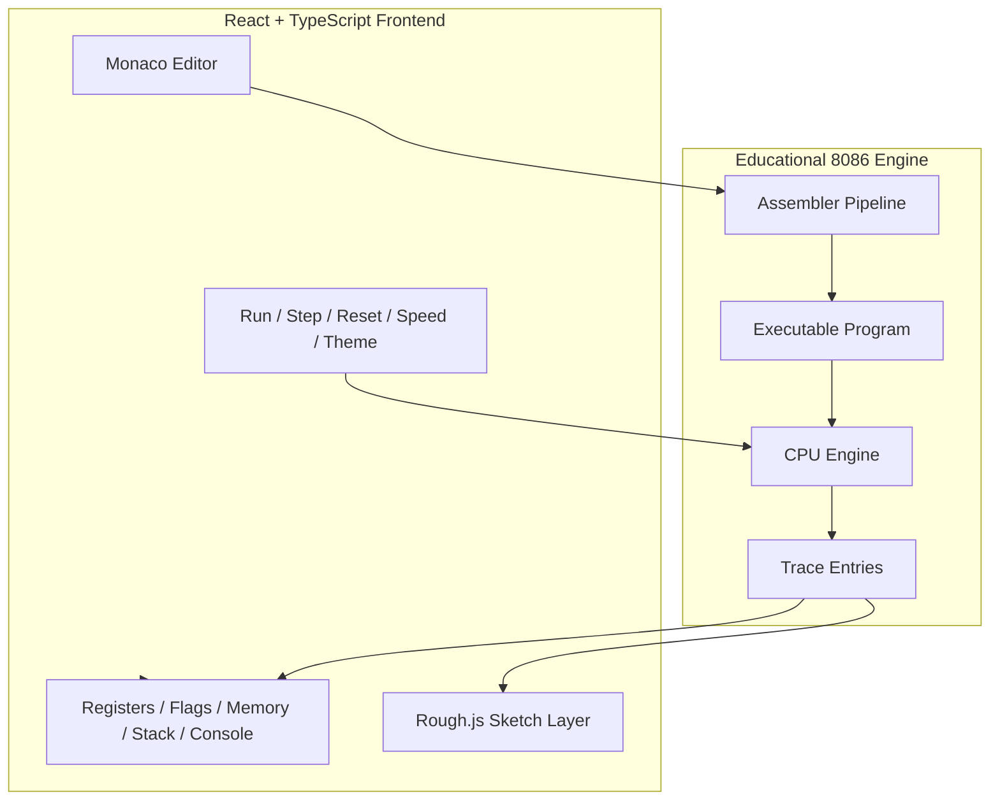
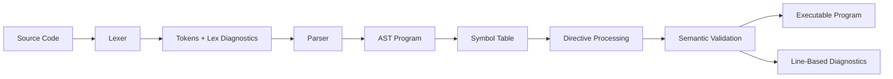
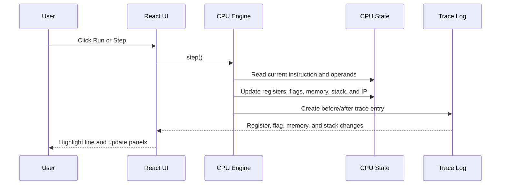
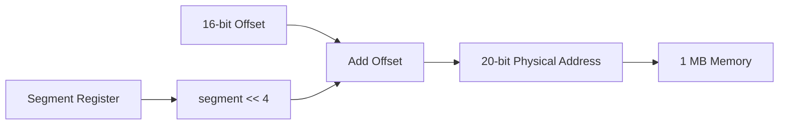
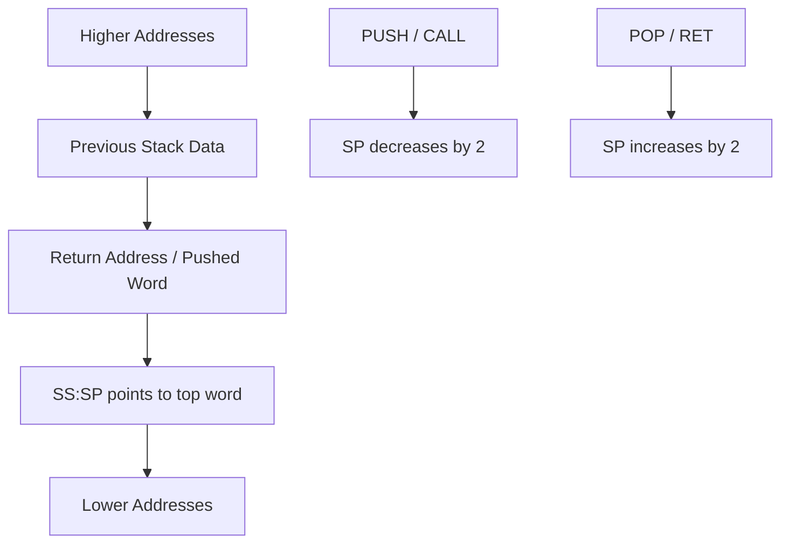

# Sketch86

Sketch86 is a browser-based 8086 assembly IDE and educational simulator with a restrained comic-sketch interface. It is built for students learning classroom 8086 assembly, especially MASM/TASM-like syntax, registers, flags, memory, stack behavior, procedures, arrays, and simple DOS-style console output.

This project is intentionally honest about scope: Sketch86 is not DOSBox, EMU8086, a complete MASM/TASM replacement, or a full DOS/BIOS emulator. It is a learning tool that explains supported behavior clearly and reports unsupported features instead of pretending to run everything.

## Table of Contents

- [1. Project Overview](#1-project-overview)
- [2. Goals and Audience](#2-goals-and-audience)
- [3. Feature Summary](#3-feature-summary)
- [4. Quick Start](#4-quick-start)
- [5. Using the Application](#5-using-the-application)
- [6. System Architecture](#6-system-architecture)
- [7. Assembler Pipeline](#7-assembler-pipeline)
- [8. CPU Execution Model](#8-cpu-execution-model)
- [9. Memory and Stack Model](#9-memory-and-stack-model)
- [10. Supported Assembly Syntax](#10-supported-assembly-syntax)
- [11. Interrupts and Terminal Input](#11-interrupts-and-terminal-input)
- [12. Built-In Examples](#12-built-in-examples)
- [13. Project Structure](#13-project-structure)
- [14. Public Engine API](#14-public-engine-api)
- [15. Testing and Quality Checks](#15-testing-and-quality-checks)
- [16. Compatibility and Limitations](#16-compatibility-and-limitations)
- [17. Future Work](#17-future-work)
- [18. GitHub Setup](#18-github-setup)

## 1. Project Overview

Sketch86 combines a modern React frontend with a custom TypeScript 8086 educational engine. Students can write assembly, run it step by step, inspect CPU state, watch register and flag changes, view memory and stack activity, and see console output produced by supported DOS-style interrupts.

The visual design uses Rough.js to give panels and controls a hand-drawn classroom feel while keeping the product usable as an IDE. Animations are tied to actual simulator state changes, such as a changed register, a moved instruction pointer, stack activity, or updated memory.

## 2. Goals and Audience

Sketch86 is designed for:

- Computer organization and assembly language students.
- Instructors who need a browser-based teaching aid.
- Beginners who want line-by-line visibility into 8086 behavior.
- Classroom assignments involving registers, arrays, procedures, flags, stack operations, and basic `INT 21h` output.

Project goals:

- Make 8086 execution visible and understandable.
- Accept familiar MASM/TASM-like educational source code.
- Provide line-based diagnostics instead of crashes.
- Keep compatibility claims accurate.
- Keep the UI clean, readable, and fast enough for repeated classroom use.

## 3. Feature Summary

Core simulator features:

- Monaco-based assembly editor with syntax coloring and diagnostics.
- Run, Step, Stop, and Reset controls.
- Speed presets: Slow `600ms`, Normal `220ms`, Fast `80ms`, and Turbo `20ms`.
- Light and dark mode with saved preference.
- Active executed-line highlighting in the editor.
- Register, flag, memory, stack, trace, and terminal panels.
- Terminal input queue for `INT 21h AH=01h`.
- 15 built-in example programs.
- Visible support matrix for supported, partial, and unsupported behavior.

Technology stack:

- Vite
- React
- TypeScript
- Monaco Editor
- Rough.js
- Framer Motion
- Vitest

## 4. Quick Start

Install dependencies:

```bash
npm install
```

Start the development server:

```bash
npm run dev
```

Open the app:

```text
http://127.0.0.1:5173/
```

Build a production bundle:

```bash
npm run build
```

Preview the production bundle:

```bash
npm run preview
```

Run checks and tests:

```bash
npm run check
npm run test
```

## 5. Using the Application

Sketch86 has three main sections:

| Section | Purpose |
| --- | --- |
| Lab | Write, assemble, run, step, and inspect a program. |
| Examples | Load complete classroom-style assembly examples. |
| Support Matrix | See which instructions, directives, interrupts, and addressing forms are supported. |

### Lab Controls

| Control | Behavior |
| --- | --- |
| Run | Executes instructions repeatedly using the selected speed. |
| Step | Executes exactly one instruction. |
| Stop | Pauses a running program. |
| Reset | Reassembles and returns the CPU to the initial state. |
| Speed | Changes the delay used by Run. |
| Theme | Switches between light and dark mode. |

### Lab Panels

| Panel | What it shows |
| --- | --- |
| Code Editor | Source code, diagnostics, and active executed-line highlighting. |
| Execution Sketch | A compact visual trace of the current execution state. |
| Registers | General, index, segment, stack, and instruction pointer values. |
| Flags | `CF`, `PF`, `AF`, `ZF`, `SF`, `TF`, `IF`, `DF`, and `OF`. |
| Console | Program output, runtime trace, diagnostics, and terminal input. |
| Memory | Program/data bytes and recent memory changes. |
| Stack | Dynamic `SS:SP` stack view with push/pop/call/ret activity. |

## 6. System Architecture



The engine is separated from the UI. The frontend does not parse assembly manually; it sends source text through the engine and consumes typed outputs such as diagnostics, executable instructions, CPU state, and trace entries.

## 7. Assembler Pipeline



Pipeline responsibilities:

- The lexer recognizes identifiers, registers, mnemonics, directives, numbers, strings, comments, operators, brackets, and punctuation.
- The parser builds typed AST nodes for instructions, labels, directives, data declarations, and `EQU` constants.
- The assembler resolves symbols, handles data layout, applies directives, validates operands, and produces an executable program.
- Diagnostics carry source locations so Monaco can show useful editor markers.

## 8. CPU Execution Model



Each instruction step produces a trace entry. A trace entry records the instruction line, address, explanation, before/after snapshots, and change lists for registers, flags, memory, and stack activity.

## 9. Memory and Stack Model

### Segment:Offset Addressing



Physical address calculation:

```text
physical = ((segment << 4) + offset) & 0xFFFFF
```

Memory behavior:

- Memory size is 1 MB.
- Byte writes update one address.
- Word writes use little-endian order.
- Data declarations are loaded into the program memory image.
- The UI highlights recent memory changes.

### Stack Behavior



The stack uses `SS:SP`, grows downward, and stores words in little-endian form. The stack panel dynamically expands its visible rows as stack activity grows, while still scrolling inside the panel instead of resizing the page.

## 10. Supported Assembly Syntax

Sketch86 supports an educational MASM/TASM-like syntax.

### Program Structure

Common classroom structure:

```asm
.model small
.stack 100h

.data
msg db "Hello$"

.code
main:
    mov ax, @data
    mov ds, ax
    lea dx, msg
    mov ah, 9h
    int 21h
    mov ah, 4Ch
    int 21h
end main
```

### Directives

Supported or accepted directives include:

- `ORG`
- `DB`
- `DW`
- `DUP`
- `EQU`
- `END`
- `.MODEL`
- `.STACK`
- `.DATA`
- `.CODE`
- `PROC`
- `ENDP`
- `SEGMENT`
- `ENDS`
- `ASSUME`
- `OFFSET`

Some directives are accepted for classroom compatibility but are not fully modeled like a real assembler/linker.

### Registers

16-bit registers:

```text
AX BX CX DX SI DI BP SP CS DS ES SS IP
```

8-bit high/low registers:

```text
AH AL BH BL CH CL DH DL
```

High/low register behavior:

```text
AX = 1234h
AL = 56h  -> AX = 1256h
AH = 56h  -> AX = 5634h
```

### Compatibility Instructions

Sketch86 supports `PUSHA` and `POPA` for classroom/emulator compatibility:

```asm
PUSHA   ; Push AX, CX, DX, BX, original SP, BP, SI, DI
POPA    ; Pop DI, SI, BP, discard saved SP, then pop BX, DX, CX, AX
```

Important accuracy note: `PUSHA` and `POPA` are **80186+ instructions**, not original 8086 instructions. Sketch86 supports them because many students encounter them in examples and teaching tools, but the Support Matrix labels them as compatibility behavior.

32-bit forms such as `PUSHAD` and `POPAD` are recognized but unsupported because Sketch86 is an educational 16-bit simulator.

### Flags

Visible flags:

```text
CF PF AF ZF SF TF IF DF OF
```

The simulator updates flags for supported arithmetic, comparison, logical, shift, rotate, and flag-control instructions according to the educational model implemented in the engine.

### Data Declarations

Examples:

```asm
value db 65
wordValue dw 1234h
arr dw 5, 10, 15, 20, 25
msg db "Hello$"
buffer db 10 dup(?)
```

`DB` allocates bytes, `DW` allocates words, strings allocate character bytes, and `DUP` repeats values.

### Addressing Modes

Accepted examples:

```asm
mov ax, [bx]
mov al, [si]
mov ax, [bx+si+4]
mov ax, [bp+di+10h]
add ax, arr[si]
mov byte ptr [1000h], 65
mov word ptr [1002h], 1234h
```

Rejected examples:

```asm
mov ax, [ax]
mov ax, [sp]
mov ax, [bx+bp]
mov ax, [si+di]
```

These forms are rejected because they are not valid 8086 memory addressing combinations.

## 11. Interrupts and Terminal Input

Supported learning-friendly interrupts:

| Interrupt | Service | Behavior |
| --- | --- | --- |
| `INT 20h` | Terminate | Ends the program. |
| `INT 21h AH=01h` | Keyboard input | Reads one queued terminal character into `AL`. |
| `INT 21h AH=02h` | Print character | Prints the character in `DL`. |
| `INT 21h AH=09h` | Print string | Prints a `$`-terminated string from `DS:DX`. |
| `INT 21h AH=4Ch` | Terminate | Ends the program. |

Terminal input works like a small input buffer. If a program reaches `INT 21h AH=01h` and the input queue is empty, execution pauses. When text is sent, Sketch86 feeds characters one by one as later input interrupts request them.

Unsupported DOS or BIOS interrupts are reported clearly instead of crashing the app.

## 12. Built-In Examples

Sketch86 includes 15 complete examples.

| Category | Examples |
| --- | --- |
| Register basics | Move values into registers, high/low register demo |
| Arithmetic and flags | Add two numbers, subtract two numbers, compare values, demonstrate flags |
| Control flow | Conditional jump, loop with `CX` |
| Stack and procedures | Stack push/pop, procedure with `CALL` and `RET` |
| Memory and arrays | Use memory variables, array sum, find maximum value |
| Console I/O | Print a character, print a string |

### Highlighted Classwork Example: Array Sum

The built-in array-sum example covers data declarations, array indexing, `LOOP`, procedures, division, and `INT 21h` output.

Expected output:

```text
The sum of the array [5, 10, 15, 20, 25] is: 75
```

Key concepts:

- `arr dw 5, 10, 15, 20, 25` creates a word array.
- `arr[si]` reads each word using indexed addressing.
- `ADD si, 2` advances to the next word.
- `LOOP` decrements `CX` and repeats while `CX` is not zero.
- `INT 21h AH=09h` prints the message.
- `INT 21h AH=02h` prints decimal digits.

## 13. Project Structure

```text
Sketch86
|-- src
|   |-- App.tsx
|   |-- components
|   |   |-- console
|   |   |-- docs
|   |   |-- editor
|   |   |-- flags
|   |   |-- layout
|   |   |-- memory
|   |   |-- registers
|   |   |-- rough
|   |   `-- stack
|   |-- engine
|   |   |-- assembler
|   |   |-- cpu
|   |   |-- errors
|   |   |-- flags
|   |   |-- instructions
|   |   |-- interrupts
|   |   |-- lexer
|   |   |-- memory
|   |   |-- parser
|   |   |-- trace
|   |   |-- isa.ts
|   |   `-- types.ts
|   |-- examples
|   `-- tests
|-- index.html
|-- package.json
|-- vite.config.ts
`-- README.md
```

Important folders:

| Path | Responsibility |
| --- | --- |
| `src/engine` | Lexer, parser, assembler, CPU, memory, flags, interrupts, trace, and public types. |
| `src/components` | UI panels, editor, support matrix, Rough.js components, and layout. |
| `src/examples` | Complete built-in assembly examples. |
| `src/tests` | Vitest regression tests for engine behavior. |

## 14. Public Engine API

Primary engine functions:

```ts
lex(source)
parse(tokens)
assemble(source, options)
createCPU(program, options)
cpu.step()
cpu.run(maxInstructions)
getSupportMatrix()
```

Core public types:

- `Token`
- `SourceLocation`
- `Diagnostic`
- `AstProgram`
- `AstInstruction`
- `AstDirective`
- `Operand`
- `ExecutableProgram`
- `Instruction`
- `SymbolTable`
- `CPUStateSnapshot`
- `Registers`
- `Flags`
- `Segments`
- `TraceEntry`
- `RegisterChange`
- `FlagChange`
- `MemoryChange`
- `StackChange`
- `SupportMatrixEntry`

## 15. Testing and Quality Checks

Run TypeScript validation:

```bash
npm run check
```

Run unit and regression tests:

```bash
npm run test
```

Run a production build:

```bash
npm run build
```

Current tests cover engine-level behavior such as:

- Lexing comments, strings, numbers, labels, brackets, directives, and memory-size keywords.
- Parsing instructions, labels, directives, memory operands, expressions, and data definitions.
- Assembling symbols, data, `ORG`, `DB`, `DW`, `DUP`, `EQU`, and invalid references.
- High/low register behavior.
- 1 MB memory reads/writes and little-endian word storage.
- Valid and invalid 8086 addressing modes.
- Arithmetic, logical, stack, jumps, calls, returns, flags, and interrupts.
- Compatibility stack instructions such as `PUSHA` and `POPA`.
- Example regressions, including the array-sum program.

## 16. Compatibility and Limitations

Sketch86 supports an educational MASM/TASM-like 8086 syntax. It does not yet support every assembler macro, directive, instruction edge case, or DOS/BIOS interrupt.

The in-app Support Matrix is the source of truth for current support. At a high level:

| Area | Status |
| --- | --- |
| Core classroom instructions | Supported for educational execution. |
| `PUSHA` / `POPA` | Supported as 80186+ classroom/emulator compatibility instructions. |
| `PUSHAD` / `POPAD` | Unsupported because they are 32-bit instructions. |
| Some advanced or environment-specific instructions | Partial or unsupported. |
| MASM/TASM classroom directives | Supported or accepted with honest limits. |
| Full assembler macro system | Not supported. |
| Real DOS process environment | Not supported. |
| BIOS and unsupported DOS interrupts | Reported as unsupported. |
| Real binary `.COM` or `.EXE` generation | Not supported. |

This honesty is intentional. The goal is to teach how 8086 state changes, not to emulate an entire DOS machine.

## 17. Future Work

Possible future improvements:

- Broader instruction coverage with more edge-case flag tests.
- More DOS and BIOS interrupt services where safe and educational.
- Import/export of assembly files.
- Breakpoints and watch expressions.
- Richer memory inspector with segment selection.
- More examples for strings, nested procedures, and pointer-style memory work.
- Optional classroom worksheets generated from examples.

## 18. GitHub Setup

For a first full-project push:

```bash
git init
git add .
git commit -m "first commit"
git branch -M main
git remote add origin https://github.com/Abubakkar-Khan/Sketch86.git
git push -u origin main
```

The repository intentionally ignores generated or heavy files such as `node_modules`, `dist`, `.npm-cache`, Vite logs, and TypeScript build info.
