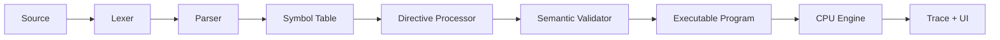

# Sketch86

Sketch86 is a modern browser-based 8086 assembly IDE and educational simulator. It focuses on CPU behavior, MASM/TASM-like classroom syntax, step-by-step execution, memory/register/flag visualization, and clear explanations.

It is not a DOSBox clone and does not claim complete MASM, TASM, EMU8086, BIOS, or DOS compatibility. Unsupported features are reported clearly.

## Run

```bash
npm install
npm run dev
```

Then open:

```text
http://127.0.0.1:5173/
```

Useful commands:

```bash
npm run test
npm run build
npm run check
```

## Architecture



The engine lives under `src/engine` and is independent from the React UI. The UI lives under `src/components` and consumes only typed engine outputs.

## Engine API

```ts
lex(source)
parse(tokens)
assemble(source, options)
createCPU(program)
cpu.step()
cpu.run(maxInstructions)
getSupportMatrix()
```

Core public types include `Token`, `Diagnostic`, `AstProgram`, `Operand`, `ExecutableProgram`, `CPUStateSnapshot`, `TraceEntry`, and `SupportMatrixEntry`.

## Supported Syntax

Sketch86 supports an educational MASM/TASM-like 8086 syntax:

- Labels and procedures: `label:`, `PROC`, `ENDP`
- Directives: `ORG`, `DB`, `DW`, `DUP`, `EQU`, `END`, `.MODEL`, `.STACK`, `.DATA`, `.CODE`, `SEGMENT`, `ENDS`, `ASSUME`, `OFFSET`
- Registers: `AX BX CX DX AH AL BH BL CH CL DH DL SI DI BP SP CS DS ES SS IP`
- Flags: `CF PF AF ZF SF TF IF DF OF`
- Valid 8086 memory forms such as `[BX]`, `[SI]`, `[BX+SI+4]`, `[BP+DI+10h]`, and variable indexing like `arr[si]`
- Size hints: `BYTE PTR`, `WORD PTR`
- Strings and numbers such as `'Hello$'`, `"Hello$"`, `1234h`, `10101010b`, `77o`

Invalid addressing modes like `[AX]`, `[SP]`, `[BX+BP]`, and `[SI+DI]` produce line-based errors.

## CPU Model

- 1 MB memory model
- Segment:offset physical addressing
- Little-endian byte and word memory operations
- High/low register mapping for `AH/AL`, `BH/BL`, `CH/CL`, `DH/DL`
- Stack uses `SS:SP` and grows downward
- Each step returns a trace entry with before/after snapshots and register, flag, memory, and stack changes

## Interrupts

Learning-friendly interrupt support:

- `INT 20h`: terminate
- `INT 21h AH=01h`: simulated keyboard input
- `INT 21h AH=02h`: display character in `DL`
- `INT 21h AH=09h`: display `$`-terminated string at `DS:DX`
- `INT 21h AH=4Ch`: terminate

Other interrupts report unsupported diagnostics instead of crashing.

## UI

The app is built with Vite, React, TypeScript, Monaco Editor, Framer Motion, Tailwind CSS, and Rough.js.

Visible sections:

- Lab
- Examples
- Support Matrix

The old top-right CPU mascot has been removed. Rough.js remains for restrained hand-drawn panels, controls, diagrams, and state-change arrows. Animations are subtle and tied to meaningful CPU state changes.

The Lab toolbar includes:

- Run, Step, Reset, and Stop controls
- Speed presets: Slow `600ms`, Normal `220ms`, Fast `80ms`, Turbo `20ms`
- Light/Dark mode toggle saved in `localStorage`
- Example loader

The terminal input row feeds simulated keyboard input to `INT 21h AH=01h`. If a program reaches that interrupt with no queued input, execution pauses until input is sent.

## Examples

The app includes 15 built-in examples:

1. Move values into registers
2. Add two numbers
3. Subtract two numbers
4. Compare values
5. Conditional jump
6. Loop with CX
7. Stack push/pop
8. Procedure with CALL and RET
9. Array sum
10. Find maximum value
11. Print a character using `INT 21h AH=02h`
12. Print string using `INT 21h AH=09h`
13. Use memory variables
14. Demonstrate flags
15. Demonstrate high/low registers

The COAL array-sum example is covered by tests and prints:

```text
The sum of the array [5, 10, 15, 20, 25] is: 75
```

## Compatibility Statement

This simulator supports an educational MASM/TASM-like 8086 syntax. It does not yet support every assembler macro, directive, instruction edge case, or DOS/BIOS interrupt.

The support matrix in the app is the source of truth for supported, partial, and unsupported features.

## GitHub Setup

For a first full-project push:

```bash
git init
git add .
git commit -m "first commit"
git branch -M main
git remote add origin https://github.com/Abubakkar-Khan/Sketch86.git
git push -u origin main
```

The repository intentionally ignores `node_modules`, `dist`, `.npm-cache`, Vite logs, and TypeScript build info.
